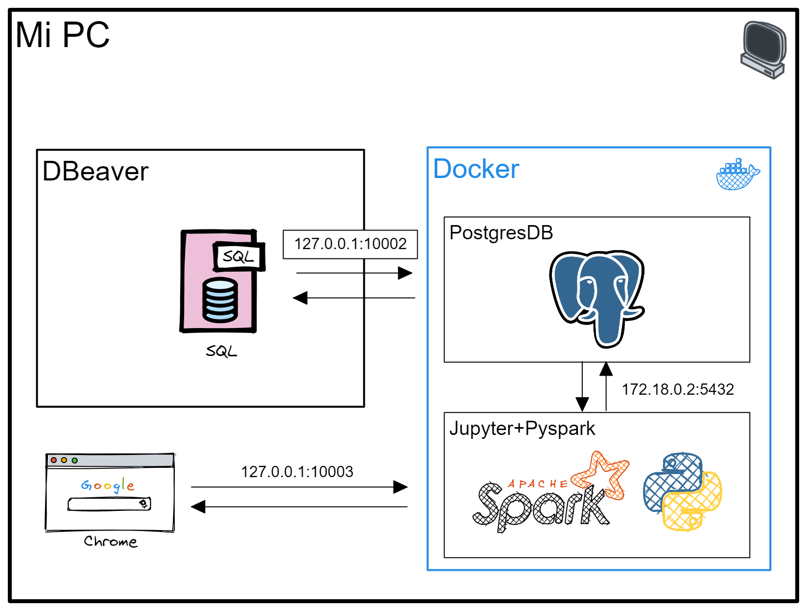

# Semana 1

## Arquitectura del Docker-Compose



## ¿Cómo configurar y ejecutar Docker?

### Requerimientos:
* Instalar Docker
* Instalar Docker Compose
* Instalar Docker Desktop
* Instalar WSL2 (Windows Subsystem for Linux)

### Configurar WSL2:
* Crear archivo de configuración de WSL2 (**.wslconfig**) en la ruta (**C:\Users\\{username}\\.wslconfig**) con el siguiente contenido:
```bash
[wsl2]
processors=1
memory=2GB
```
* Esto es para que docker no consuma demasiados recursos de la máquina, ya que por defecto consume 4GB de RAM y 2 procesadores.
* Al aplicar esta configuración, se debe reiniciar la máquina.
```bash
wsl --shutdown
```


<!-- ```bash
[wsl2]
processors=1
memory=2GB
swap=0
localhostForwarding=true
``` -->


### Crear y ejecutar la imagen de docker:
```bash
# Windows
docker-compose up --build

# Linux
sudo docker-compose up --build
```

### Buscar la IP interna de la base de datos Postgres
```bash
# Windows
docker inspect postgres_db -f “{{json .NetworkSettings.Networks }}”

# Linux
docker inspect postgres_db | grep IPAddress
```

## Abrir Jupyter Notebook con Pyspark en el navegador:
1. Ingresar en la página de [Jupyter Notebook](http://127.0.0.1:8888/lab?token=7dd5840a94ba553eef12d2c268a2b99cbbf0f712ae50ecd5), con el token que nos da la app.
2. Abrir el archivo **ejercicios_python.ipynb**.

## Conexion DBeaver con Postgres DB:
1. Descargar e instalar [DBeaver](https://dbeaver.io/download/)
2. Crear una nueva conexión con los siguientes datos:
    - Host: **localhost**
    - Port: **10002**
    - Database: **postgres**
    - User: **postgres**
    - Password: **postgres**
3. Click en **Test Connection** y luego en **Finish**.

## Conexion de Pyspark con Postgres DB:
1. Abrir el archivo **ejercicios_sql.ipynb**.
2. Ejecutar la celda de código que contiene la conexión con la base de datos.

### En mi caso el output fue:
```bash
# Windows
# postgres_db --> 172.18.0.2

# Linux
# postgres_db --> 172.19.0.3
```

<!-- Ingresar en la página de [PG Admin 4](http://127.0.0.1:10003/), con el user: **admin@admin.com** y contraseña: **admin**.
Luego click en **Agregar un Nuevo Servidor** -->

<!-- ### Por cualquier problema, para reiniciar el servicio de Docker y parar los containers:
```bash
sudo systemctl restart docker.socket docker.service
docker container ls
docker rm -f <container id>
``` -->


# Ejercicios Python:
1. Escribir un programa que lea un número impar por teclado. Si el usuario no introduce un número impar, debe repetirse el proceso hasta que lo introduzca correctamente.
2. Escribir un programa que pida al usuario cuántos números quiere introducir. Luego que lea todos los números y realice una media aritmética.
3. Utilizando la función range() y la conversión a listas generar las siguientes listas dinámicamente:
    - Todos los números del 0 al 10 [0, 1, 2, ..., 10]
    - Todos los números del -10 al 0 [-10, -9, -8, ..., 0]
    - Todos los números pares del 0 al 20 [0, 2, 4, ..., 20]
    - Todos los números impares entre -20 y 0 [-19, -17, -15, ..., -1]
    - Todos los números múltiples de 5 del 0 al 50 [0, 5, 10, ..., 50]
4. Dadas dos listas (las que se quiera crear), generar una tercera con los elementos que estén presentes en AMBAS listas. Retornar esta nueva lista pero sin elementos duplicados.
5. Escribir un programa que sume todos los números enteros impares desde el 0 hasta el 100.
6. Contar cuantas veces aparece un elemento en una lista.

# Soluciones Python:
Para ejecutar las soluciones de los ejercicios y realizar pruebas, se debe abrir el archivo **ejercicios_python_jupyter.ipynb** en [Jupyter Notebook]( http://127.0.0.1:8888/lab?token=coder).


# Ejercicios SQL
1. Extraer agentes cuyo nombre empiezen por M o terminen en O.
2. Escriba una consulta que produzca una lista, en orden alfabético, de todas las distintas ocupaciones en la tabla Customer que contengan la palabra "Engineer".
3. Escriba una consulta que devuelva el ID del cliente, su nombre y una columna  Mayor30 que contenga "Sí "si el cliente tiene más de 30 años y "No" en caso contrario.
4. Escriba una consulta que devuelva todas las llamadas realizadas a clientes de la profesión de ingeniería y muestre si son mayores o menores de 30, así como si terminaron comprando el producto de esa llamada.
5. Escriba dos consultas: una que calcule las ventas totales y las llamadas totales realizadas a los clientes de la profesión de ingeniería y otra que calcule las mismas métricas para toda la base de clientes.